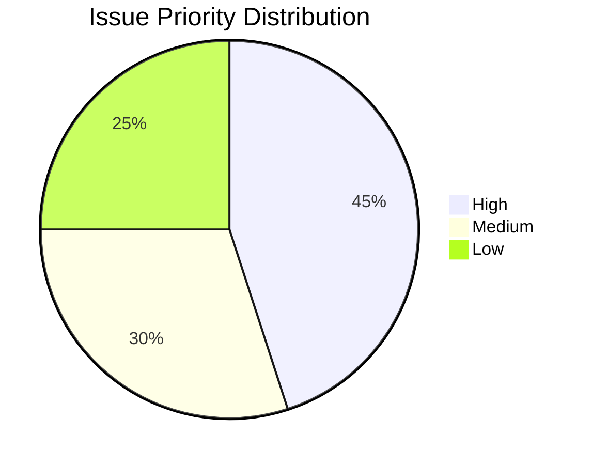

# Project Automation Documentation

This repository uses comprehensive GitHub project board automation to streamline issue and pull request management.

## Overview

The project automation system provides:
- **Automated issue lifecycle management** (To Do → In Progress → Review → Done)
- **Smart labeling** based on content analysis
- **Component-based assignment** 
- **Priority detection** and automatic prioritization
- **Comment-based status controls**
- **Weekly maintenance** tasks

## Current Sprint Progress


## Issue Statistics
- 
- 

## Priority Breakdown


## Project Board Views

### 1. Sprint Board
A kanban-style board with columns:
- **Backlog**: New issues ready to be worked on (`status:todo`)
- **In Progress**: Currently active work (`status:in-progress`)
- **Review**: Items waiting for review (`status:review`) 
- **Done**: Completed items (`status:done`)

### 2. Priority View
Table view grouped by priority levels (high/medium/low) showing assignees, labels, and milestones.

### 3. Component View
Board organized by technical components:
- Backend, Frontend, API, DevOps, Documentation

### 4. Effort Planning
Table view grouped by estimated effort (small/medium/large) for sprint planning.

### 5. Bug Tracking
Dedicated board for tracking bugs through their lifecycle.

## Automation Rules

### Issue Lifecycle

**New Issue Created:**
- Automatically labeled with `status:todo`
- Auto-assigned based on component detection
- Priority set based on keywords (critical, urgent, etc.)
- Effort estimated based on complexity indicators

**Issue Assigned:**
- Moved from `status:todo` to `status:in-progress`
- Added to assignee's active work queue

**Issue Closed:**
- Moved to `status:done`
- Completion timestamp added as comment

### Pull Request Lifecycle

**PR Opened:**
- Automatically labeled with `status:review`
- Type detection (bugfix, feature, docs, refactor)
- Auto-request reviewers based on component

**PR Merged:**
- Labeled as `status:done`
- Linked issues automatically closed

### Comment Commands

Use these commands in issue comments to manually control status:

- `/in-progress` or `/start` - Move to In Progress (auto-assigns commenter)
- `/review` or `/ready` - Move to Review
- `/done` or `/complete` - Close issue and mark as Done
- `/todo` or `/backlog` - Move back to To Do

### Smart Labeling

The system automatically detects and applies labels based on:

**Components:**
- API-related keywords → `component:api`
- Frontend/UI keywords → `component:frontend`
- Backend/server keywords → `component:backend`
- Deploy/Docker keywords → `component:devops`
- Documentation keywords → `component:docs`

**Types:**
- Bug-related keywords → `type:bug`
- Feature-related keywords → `type:feature`
- Testing keywords → `type:testing`

**Priority:**
- Critical/urgent/security → `high-priority`
- Bug/issue/problem → `medium-priority`
- Everything else → `low-priority`

**Effort:**
- Quick/small/simple → `effort:small`
- Complex/major/significant → `effort:large`
- Everything else → `effort:medium`

## Weekly Maintenance

Every Monday at 9 AM, the system automatically:
- Closes stale issues (inactive for 30+ days)
- Generates weekly project summary
- Updates project metrics

## Setup Instructions

### 1. Initialize Labels
Run the label setup script to create all required labels:

```bash
# Set your GitHub token
export GITHUB_TOKEN=your_personal_access_token

# Run the setup script
python .github/setup-project-labels.py
```

### 2. Configure Project Board
1. Create a GitHub project board
2. Update the project URL in `.github/workflows/project-automation.yml`
3. Ensure the project has columns matching the automation expectations

### 3. Team Configuration
Update component assignments in the automation workflows:

```yaml
componentAssignments = {
  'component:backend': 'your-backend-dev',
  'component:frontend': 'your-frontend-dev',
  'component:api': 'your-api-dev'
}
```

## Team Velocity
Track completed story points per sprint to measure team velocity and improve planning accuracy.

## Best Practices

1. **Use descriptive issue titles** - Automation relies on keyword detection
2. **Apply component labels** early for proper assignment
3. **Use comment commands** to manually control flow when needed
4. **Keep project board views** updated with your team's workflow
5. **Review automation logs** regularly to ensure proper functioning